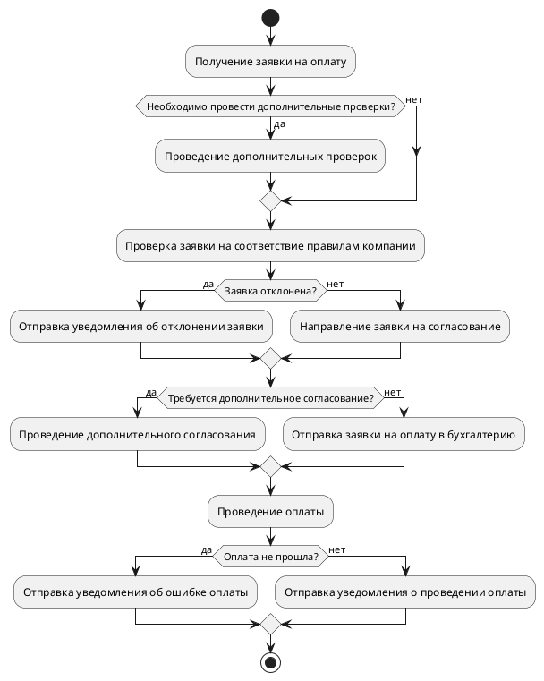

# Какая проблема есть?

**Закупщики** всех уровней ежедневно сталкиваются с поиском ответа на вопрос: кого пригласить участвовать в тендере? Кому отправить запрос на получение коммерческого предложения? Под «Кого» и «Кому» имеются ввиду компании (потенциальные контрагенты) профиль работы которых и регион работы которых соответствует текущей потребности нашей организации. Каждый Закупщик ведёт свою собственную базу в своём формате. Также ведётся база контрагентов в Excel, содержащая часть данных. С аналогичной проблемой сталкиваются и сотрудники дочерних компаний. Кроме того, стоит проблема актуальности данных. Имеющиеся контактные данные устаревают и требуют периодического обновления.

# Диаграмма от Зины

Диаграмма отображает последовательность шагов в процессе согласования заявки на оплату, начиная с получения заявки на оплату и заканчивая отправкой уведомления о проведении оплаты. Если заявка не соответствует правилам компании, она может быть отклонена и отправлена на доработку. Если нужно провести дополнительные проверки или согласование, они также могут быть проведены в процессе согласования. В конечном итоге заявка отправляется на оплату в бухгалтерию, и если оплата прошла успешно, отправляется уведомление о проведении оплаты. Если же возникла ошибка при оплате, отправляется уведомление об ошибке оплаты.